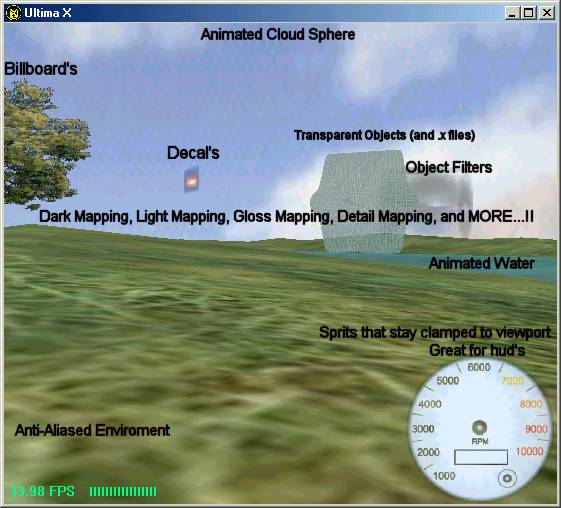

<div align="center">

## UltimaX \(Almost Complete DX8 Engine\) MUST SEE\!\! \(UPDATE\)


</div>

### Description

Awesome! Look at screenshot. Making it to be programmer friendly.. Features include - 2D Sound, 3D Sound, Midi(with soundFX's), SoundFX's, Transparent objects(even .x files),Partial Collision Detection(lol need to fix landscape Collision Detection - you climb up a hill when no hill is there :)) animated water, animated enviroment sphere, Object Filters(Dark Mapping, light mapping, gloss mapping, detail mapping, and much more), Enviroment Filters(Anistropic, Bilinear, ETC.) To much to list.. must see.. This is beta. Not complete yet Sorry for not commenting, I will on next version(I wanted to get it uploaded) PLEASE VOTE!!!!

www.Bright.net/~james-d-21/

(there are no advertisments, Just download link)
 
### More Info
 


<span>             |<span>
---                |---
**Submitted On**   |2002-02-22 00:04:00
**By**             |[James Dougherty](https://github.com/Planet-Source-Code/PSCIndex/blob/master/ByAuthor/james-dougherty.md)
**Level**          |Advanced
**User Rating**    |4.9 (59 globes from 12 users)
**Compatibility**  |VB 6\.0
**Category**       |[DirectX](https://github.com/Planet-Source-Code/PSCIndex/blob/master/ByCategory/directx__1-44.md)
**World**          |[Visual Basic](https://github.com/Planet-Source-Code/PSCIndex/blob/master/ByWorld/visual-basic.md)
**Archive File**   |[UltimaX\_\(A1392481012002\.zip](https://github.com/Planet-Source-Code/james-dougherty-ultimax-almost-complete-dx8-engine-must-see-update__1-32029/archive/master.zip)

### API Declarations

```
AGIAN -
 Sorry for hardly any commenting Just wanted to show the functions and how to use them for your DX8 Engine.. THANKS -James-
```


